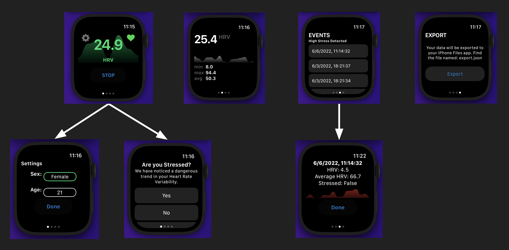
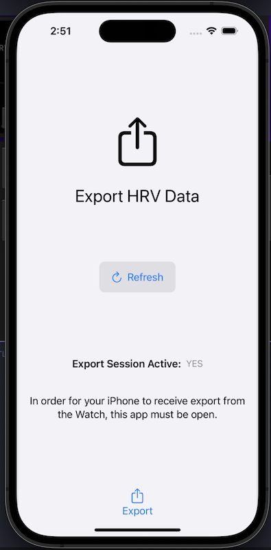

# Heart Rate Variability Monitor

> EWU Team E1 undergrad senior project (CSCD 488 & 490)
>
> Project started: 1/17/2022
>
> Project ended: 6/17/2022
>
> Project part 2 started: 1/20/2023
>
> Project part 2 ended:

## Table of Contents

- [General Information](#general-information)
- [Requirements](#requirements)
- [Technologies Used](#technologies-used)
- [Features](#features)
- [Screenshots](#screenshots)
- [Setup](#setup)
- [Usage](#usage)
- [Project Status](#project-status)
- [Room for Improvement](#room-for-improvement)
- [Beta Testing](#beta-testing)
- [Acknowledgements](#acknowledgements)
- [Contributors](#contributors)

## General Information

Studies have shown that Heart Rate Variability (HRV) has a special relationship with stress levels. Lower HRV levels indicate fight-or-flight response and higher likelihood of stress. Our problem: Traumatic brain injury patients need to be notified of dangerous HRV levels to prevent a PTSD attack. Patients will be equipped with an Apple Watch with this application deployed. Our application will actively monitor both the patient's heart rate and HRV. If a patient's HRV is predicted by our application to have a dangerous trend, the patient is notified using audio and haptics. Using machine learning methods, our application learns over time to accurately predict the likelihood of a PTSD attack based on a time-based window of HRV samples.

## Requirements

- The application will poll the patient’s heart rate and return us real-time data
- The application will store patient heart rate and HRV data over a configured amount of time.
- For dangerous HRV levels, the application will provide audible and haptic feedback.
- The application will receive patient demographics to assist the HRV algorithm. e.g. Age, history of brain trauma, heart condition, etc.
- Application will determine if a patient’s HRV will lead to a stressful event (machine learning).
- Application asks patient information about the environment the patient was in during the stressful event. e.g. Location, activity, etc.
- The application will be implemented to run as a background service, always monitoring HRV.

## Technologies Used

- XCode 13.4.1
- SwiftUI 5
- HealthKit
- CoreData

## Features

- HRV monitor
  - Regularly monitors user heart rate and HRV
  - Displays a HRV "mood ring." The UI will change color to display red, yellow, or green depending on dangerous, moderate, or healthy HRV respectively.

- HRV threat detector
  - For each new HRV value calculated, the app will predict the likelihood of a stressful event occurring.
  - Currently, the app is using a Logistic Regression model to train and predict.

- Patient settings
  - Application records patient settings (Age, Sex, etc.) and uses them to display. These are used to calculate the threshold values for the HRV "mood ring" mentioned above.

- Intrusive feedback
  - If the application predicts a dangerous HRV trend, the user is alerted or notified using audio and haptic feedback. If the application is in the foreground, an alert is shown; if the application is running in the background, a notification is pushed to the user.

- User feedback
  - Upon intrusive feedback alert/notification, the user will be prompted to provide metadata regarding the dangerous HRV that was predicted. This data is used to help the app learn user HRV trends.

- Manual user feedback
  - At any point in time, the user can provide metadata about their current stressful state. This expedites the learning process of the application, as the user is providing labeled data for the HRV threat detector model.

- Stress event storage
  - Each time the user provides feedback, it will be stored and available later to view. The user is able to access a log of all recorded stress events.
  - For each stored event, metadata such as the window of HRV values, average heart rate, and user feedback is available to be viewed by the user.

- Data export (**Companion App Only**)
  - The user is able to export data from the Apple Watch to their paired iOS device.

## Screenshots

<!-- If you have screenshots you'd like to share, include them here. -->

## Setup

This project requires that the following packages are installed:

- [swift-ui-charts](https://github.com/spacenation/swiftui-charts/releases/tag/1.1.0): ver 1.1.0

## Usage

It's as simple as opening the project in XCode! There are two projects to choose from:

### Standalone Apple Watch App Only

> Note that this version of the project does not have a data export feature.

This project contains only the Apple WatchKit Extension app. To run, open the project file located at: `./hrv_standalone_watch_app/HRVMonitor.xcodeproj` in XCode.

### Apple Watch and iOS Companion App

This project contains both the iOS Companion app and the Apple WatchKit Extension app. To run, open the project file located at: `./hrvm_companion_app/HRVMonitor.xcodeproj` in XCode.

## Project Status

The project is: _complete_. It is not yet decided if this project will be continued by another team.

## Room for Improvement

Future work:

- Migrate resource-intensive processes to the companion app
  - Data storage
  - Model training
  - Improve the Companion Application UI

## Beta Testing

To apply to join the Test Flight application beta testing, please contact us at `hrv.monitor.e1@gmail.com`.

## Acknowledgements

This project was made possible by Dr. Alicia Hegie and Dr. Frank Jackson of St. Luke's Rehabilitation Institute.

### Contributors

- Blake Chalpin ([b-chalpin](https://github.com/b-chalpin))
- Nick Adams ([Nick-P-Adams](https://github.com/Nick-P-Adams))
- Madison Reese ([MadisonReese](https://github.com/MadisonReese))
- Jared Adams ([AndroidDucky](https://github.com/AndroidDucky))
- Dillon Dalton ([ddalton212](https://github.com/ddalton212))
